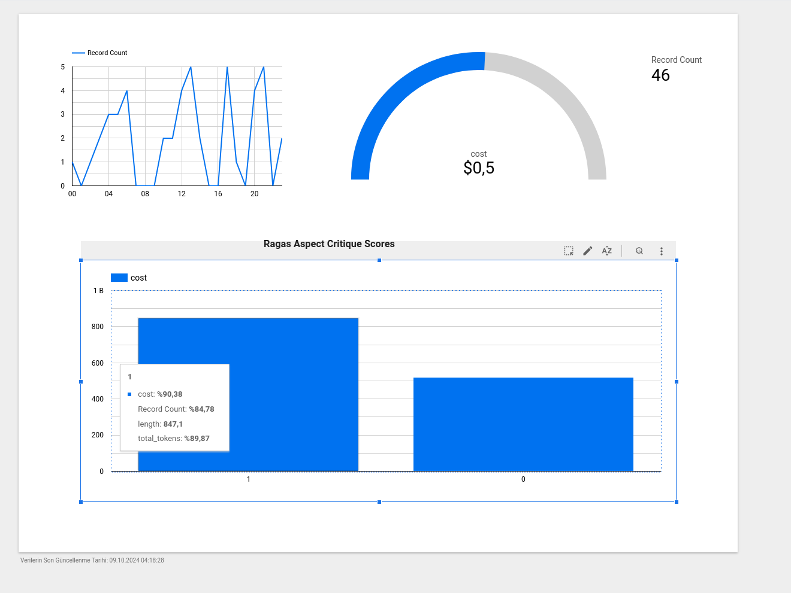

# /R/Germany Wiki Pages Helper

The /r/Germany subreddit is a community on Reddit focused on discussions related to Germany in English.

The /r/Germany wiki pages contain a number of useful resources to help users navigate key topics related to Germany. The topics range from education (university, Studienkolleg) and housing to the tax system, work and visa process.

"Shortcuts" bot in /r/Germany provides quick links to frequently referenced info like FAQs or wiki pages.

For example, if someone asks a question about insurance, the `!insurance` shortcut will return links to the relevant wiki page. The problem with this is that some wiki pages are very long, and even if the wiki page contains the answer to a specific question, you may have to read the whole page or navigate to another wiki page. Wiki helpers makes it easier to find specific answers without having to read through long pages or follow multiple links.

[Project Google Cloud Service App link](https://wikis-653995409450.europe-west10.run.app/)

## Evaluation

### Question Vector

384 is `multi-qa-MiniLM-L6-cos-v1` model.

768 is `multi-qa-distilbert-cos-v1` model.

| Model            | Hit Rate              |         MRR          |
|------------------|-----------------------|-----------------------|
| 384_docs_4o_mini | 0.822087745839637     | 0.6860010085728689    |
| 384_docs_llama   | 0.822087745839637     | 0.6860010085728689    |
| 768_docs_4o_mini | 0.8311649016641453    | 0.6961018658598076    |
| 768_docs_llama   | 0.8311649016641453    | 0.6961018658598076    |

### Content Vector

| Model            | Hit Rate              |         MRR          |
|------------------|-----------------------|-----------------------|
| 384_docs_4o_mini | 0.8717095310136157    | 0.717297024710035     |
| 384_docs_llama   | 0.8720121028744326    | 0.7173726676752392    |
| 768_docs_4o_mini | 0.8925869894099848    | 0.7341805345436204    |
| 768_docs_llama   | 0.8925869894099848    | 0.7341805345436204    |

### Content + Question Vector

| Model            | Hit Rate              |         MRR          |
|------------------|-----------------------|-----------------------|
| 384_docs_4o_mini | 0.9128593040847202    | 0.7873424104891578    |
| 384_docs_llama   | 0.9131618759455371    | 0.787418053454362     |
| 768_docs_4o_mini | 0.9231467473524962    | 0.7947503782148263    |
| 768_docs_llama   | 0.9228441754916793    | 0.7948562783661121    |

### Haystack Ragas Evaluator

| Model                          | Doc MRR Evaluator     | Doc Rec(hit rate) Evaluator     | MAP                   |
|--------------------------------|-----------------------|-----------------------|-----------------------|
| model_mini_lm_docs_4o_mini    | 0.7834947049924357    | 0.9122541603630863    | 0.7839544461253997    |
| model_mini_lm_docs_llama      | 0.7829803328290469    | 0.9113464447806354    | 0.7834400739620109    |
| model_distilbert_docs_4o_mini | 0.7919616742309635    | 0.9222390317700454    | 0.7923861153134987    |
| model_distilbert_docs_llama    | 0.7912455874936968    | 0.9213313161875946    | 0.791670028576232     |

### Haystack Ragas Evaluator Answer relevancy

[Haystack RagasEvaluator](https://haystack.deepset.ai/cookbook/rag_eval_ragas#evaluate-the-rag-pipeline)

Random selected 50 sample scores:

| Statistic | Value       |  * | Statistic | Value       |  * | Statistic | Value       |  * | Statistic | Value       |
|-----------|-------------|---|-----------|-------------|---|-----------|-------------|---|-----------|-------------|
| Count     | 50.000000   |   | Count     | 50.000000   |   | Count     | 50.000000   |   | Count     | 50.000000   |
| Mean      | 0.930749    |   | Mean      | 0.934164    |   | Mean      | 0.910511    |   | Mean      | 0.883394    |
| Std Dev   | 0.194594    |   | Std Dev   | 0.194037    |   | Std Dev   | 0.234884    |   | Std Dev   | 0.266121    |
| Min       | 0.000000    |   | Min       | 0.000000    |   | Min       | 0.000000    |   | Min       | 0.000000    |
| 25%       | 0.951582    |   | 25%       | 0.955874    |   | 25%       | 0.931460    |   | 25%       | 0.928617    |
| 50%       | 0.978830    |   | 50%       | 0.975092    |   | 50%       | 0.981040    |   | 50%       | 0.971967    |
| 75%       | 0.992876    |   | 75%       | 0.996937    |   | 75%       | 0.996109    |   | 75%       | 0.989022    |
| Max       | 1.000000    |   | Max       | 1.000000    |   | Max       | 1.000000    |   | Max       | 1.000000    |

### Monitoring

For monitoring, each session is stored in Bigquery and a Looker dashboard is created.

